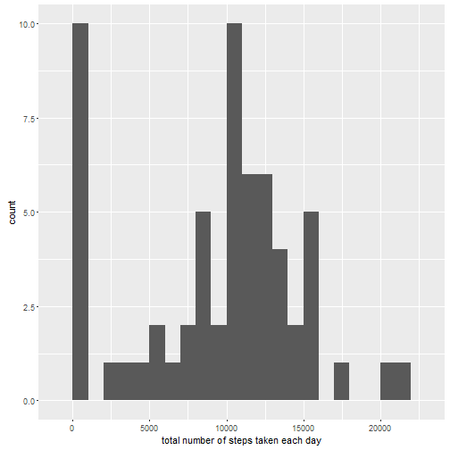
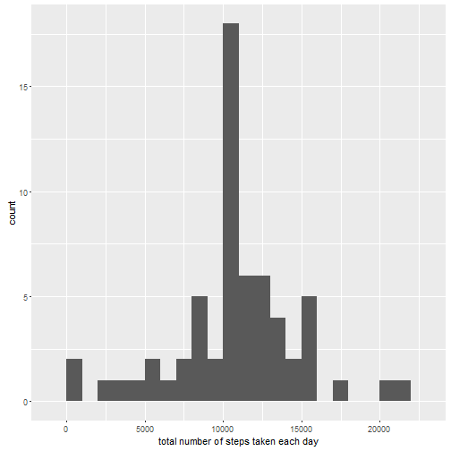

## Loading and preprocessing the data

```r
unzip(zipfile = "activity.zip")
ReadData <- read.csv("activity.csv",stringsAsFactors=FALSE)
```

## What is mean total number of steps taken per day?

```r
library(ggplot2)
total_steps <- tapply(ReadData$steps,ReadData$date,FUN=sum,na.rm=TRUE )
qplot(total_steps,binwidth=1000,xlab="total number of steps taken each day")
```



```r
mean(total_steps,na.rm=TRUE)
```

```
## [1] 9354.23
```

```r
median(total_steps,na.rm = TRUE)
```

```
## [1] 10395
```


## What is the average daily activity pattern?

```r
aver_steps <- aggregate(x=list(steps=ReadData$steps),by=list(interval=ReadData$interval),FUN=mean,na.rm= TRUE )
ggplot(data=aver_steps, aes(x=interval, y=steps)) +
  geom_line() +
  xlab("5-minute interval") +
  ylab("average number of steps taken")
```


```r
aver_steps[which.max(aver_steps$steps),]
```

```
##     interval    steps
## 104      835 206.1698
```
## Imputing missing values

```r
sum(is.na(ReadData$steps))
```

```
## [1] 2304
```

```r
fill_value <- function(steps, interval) {
  filled <- NA
  if (!is.na(steps))
    filled <- c(steps)
  else
    filled <- (aver_steps[aver_steps$interval==interval, "steps"])
  return(filled)
}
filled_data <- ReadData
filled_data$steps <- mapply(fill_value, filled_data$steps, filled_data$interval)

filled_total_steps <- tapply(filled_data$steps, filled_data$date, FUN=sum)
qplot(filled_total_steps, binwidth=1000, xlab="total number of steps taken each day")
```



```r
mean(filled_total_steps)
```

```
## [1] 10766.19
```

```r
median(filled_total_steps)
```

```
## [1] 10766.19
```


## Are there differences in activity patterns between weekdays and weekends?


```r
weekday_or_weekend <- function(date) {
  day <- weekdays(date)
  if (day %in% c("Monday", "Tuesday", "Wednesday", "Thursday", "Friday"))
    return("weekday")
  else if (day %in% c("Saturday", "Sunday"))
    return("weekend")
  else
    stop("invalid date")
}
filled_data$date <- as.Date(filled_data$date)
filled_data$day <- sapply(filled_data$date, FUN=weekday_or_weekend)
averages <- aggregate(steps ~ interval + day, data=filled_data, mean)
ggplot(averages, aes(interval, steps)) + geom_line() + facet_grid(day ~ .) +
  xlab("5-minute interval") + ylab("Number of steps")
```


